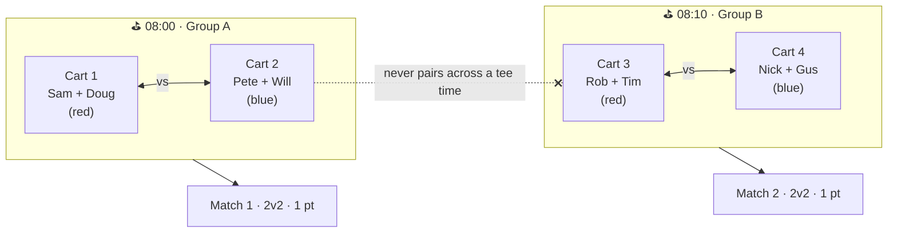

# The cart is the side

How No Gimmes turns eight guys into matches — and which matchup shapes it can
and can't build. Everything here is read out of `index.html` as it stands; no
behavior is proposed or changed.

## The unit you're missing is the cart

The match maker never looks at players. It looks at **carts**.

When you tap *Make matches: cart vs cart* (setup step 5), the app doesn't ask
"which four reds and which four blues are here." It walks each tee-time wave,
finds the carts whose occupants are **all on the same team**, lines the red ones
up against the blue ones in order, and makes a match out of each pair.

So a cart of two *becomes* a side of two. That's the whole reason a side is two
players — not the format, not the rules of golf, but the number of seats on the
screen above it.

## Three units

| Unit | What it is | What it does |
| --- | --- | --- |
| **Player** | Present/absent and red/blue, both decided per day | Sides are just for today; teams are permanent in name only |
| **Cart** | Two seats, three on the back nine. Up to four a day | **A cart is a side of a match** |
| **Wave** | Group A or B, one tee time each, holds two carts | A *container*. Never competes against anything |

## One rule, three consequences

> Walk each wave in turn. Inside it, find every cart whose occupants are all on
> the same team. Line the red ones up against the blue ones in order, and make a
> match from each pair. Anyone left over goes to the odd-man sheet.

Read it for what it *can't* do — that's the useful part:

- **A cart is the largest side that exists.** Two seats in, two players out.
  There is no step where two carts combine.
- **A mixed cart is invisible.** One red and one blue riding together isn't half
  a match — it isn't a match participant at all. The maker skips it entirely.
- **A wave is a hard boundary.** Group A carts only pair with Group A carts.

That last one is why *tee time vs tee time* has no shape to fit into. The
pairing happens **inside** a wave and never between them:

The odd-man sheet is the pressure valve for all three. Anything the rule
couldn't place lands there, and it offers exactly two outs: build a two-on-one,
or let the extra player ride along for junk and skins only.

## The two seating buttons lead opposite places

Step 4 puts *Ride with your partner* and *Mix it up* side by side. Same eight
players, same format, very different days.

| Seating | What the maker sees | Result |
| --- | --- | --- |
| **Ride with your partner** | 4 pure carts | 2 clean 2v2s, everybody placed — automatic |
| **Mix it up** (one red + one blue per cart) | 0 pure carts | All 8 fall through to the odd-man sheet |
| **Format = SINGLES** | Carts read as a guest list only | 4 × 1v1, still fenced by wave — automatic |

The middle row is worth knowing about before a Saturday morning. It isn't
broken, but the sheet you land on says *"Odd numbers — eight names don't pair
evenly,"* which is not what happened, and its primary button is labelled
*Two-on-one* while quietly building a two-on-two out of the first two reds and
first two blues. Four people are then left to place by hand. **If you want mixed
carts, plan on building that day's matches yourself.**

## Format is a separate axis

Picking FOUR-BALL or SCRAMBLE or CHAPMAN doesn't change the size or composition
of anything. Every match is still whatever the carts handed over. Format only
answers two questions:

- **How many balls do I enter?** One-ball formats (scramble, greensomes,
  Chapman, foursomes) take a single gross score per side. Own-ball formats
  (four-ball, shamble, singles) take a score per player and use each side's best
  net.
- **What handicap allowance applies?** 90% off the low man for four-ball, 50% of
  the combined for foursomes, and so on.

**SINGLES** is the exception — it swaps in a different match maker entirely (the
third row above). **MIXER** isn't really a format; it's a rotation that hands a
different format to each stretch of holes, so it inherits whatever the
underlying formats do.

## Every shape you can build today

| Shape | How you get it | Cup points | |
| --- | --- | --- | --- |
| **2 v 2** | Teammates paired in carts, then *Make matches: cart vs cart* | Yes | automatic |
| **1 v 1** | Format = SINGLES, then *Make singles*. Optionally worth double | Yes | automatic |
| **2 v 1** | Offered by the odd-man sheet when a wave leaves three; the solo player's one ball counts for his side | Yes | prompted |
| **1 v 1 🥊** | A side bet — any two players, teammates included | Never | by hand |
| **3 v 3, 4 v 4** | Not reachable. A side accepts two players and silently discards a third | — | no |

Building by hand (*+ Add match*, then tap a name and a replacement to swap) frees
up *who*, but not *how many* — and a hand-built match is always stamped with
Group A's tee time regardless of when its players actually go off, so the time on
its chip can be a polite fiction.

## Why two is load-bearing

The cup pool is computed by walking every match on the trip and adding up what
each one is worth. There's no separate "points available" setting to keep in
sync — **the number of matches *is* the size of the pool**, and the magic number
on the board follows from it.

That's the quiet consequence of side size. Eight players in two 2v2 matches put
two points on the board. The same eight in one 4v4 would put up one. So side
size isn't only a question of how you'd score the hole; it changes how much a
Saturday is worth against a Sunday, and how fast the cup can be clinched. Any
move toward bigger sides is really a decision about the shape of the whole
weekend's scoreboard — a much better reason to think it through than the two
lines of code that cap the array.

## Where this lives in the code

| What | Where |
| --- | --- |
| The pairing rule | `makeMatches()` — `index.html:2806` |
| Side capped at 2 (auto) | `index.html:2841`, and `index.html:3160` for the odd-man path |
| Side capped at 2 (by hand) | `pickplayer2` — `index.html:3189` |
| Cart seats capped at 3 | `index.html:1949` |
| Seating helpers | `ridePartner()` — `index.html:2863`; `mixItUp()` — `index.html:2886` |
| Waves on the board | tee-group rendering — `index.html:1479` |
| Format table & allowances | `FORMATS` — `index.html:498`; `ALLOWANCES` — `index.html:645` |
| Cup pool from match worths | `cup()` — `index.html:1058`, `scheduled += dr.worth` at `index.html:1062` |
